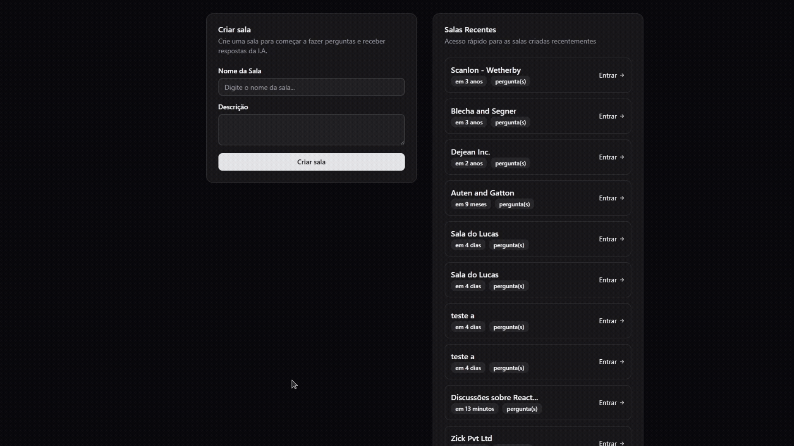

# NLW Agents

Projeto desenvolvido durante o evento **NLW Agents** da [Rocketseat](https://rocketseat.com.br/).

## 🚀 Tecnologias

Este projeto foi desenvolvido com as seguintes tecnologias:

- **React 19** - Framework para construção de interfaces de usuário
- **TypeScript** - Superset JavaScript com tipagem estática
- **Vite** - Build tool e dev server
- **React Router DOM** - Roteamento para aplicações React
- **TanStack Query** - Gerenciamento de estado e cache de dados
- **Tailwind CSS v4** - Framework CSS utility-first
- **Shadcn/ui** - Biblioteca de componentes acessíveis
- **Radix UI** - Primitivos de componentes sem estilo
- **Lucide React** - Biblioteca de ícones
- **Biome** - Linter e formatter

## 📁 Estrutura do Projeto

```
src/
├── components/      # Componentes reutilizáveis
│   └── ui/          # Componentes da UI (shadcn/ui)
├── lib/             # Utilitários e configurações
├── pages/           # Páginas da aplicação
└── assets/          # Recursos estáticos
```

## 🛠️ Padrões de Projeto

- **Component Composition** - Uso de Radix UI e Shadcn/ui para composição de componentes
- **Path Mapping** - Configuração de alias `@/` para imports absolutos
- **CSS Variables** - Uso de variáveis CSS para temas customizáveis
- **Atomic Design** - Organização de componentes em diferentes níveis de complexidade

## Back-end do projeto:

O back-end do projeto é uma aplicação que utiliza Postgres, Docker, Drizzle, Zod e TypeScript contém a API consumida aqui. Você pode conferir o repositório do back-end [aqui](https://github.com/zlucasftw/nlw-agents-server).

## 🎥 Demonstração

Uma simples demonstração de como a aplicação funciona na prática (e qual a relação entre jardineiros e React 🤔):



## ⚙️ Configuração e Instalação

### Pré-requisitos

- Node.js (versão 18 ou superior)
- npm, yarn ou pnpm

### Instalação

1. Clone o repositório:
```bash
git clone <url-do-repositorio>
cd web
```

2. Instale as dependências:
```bash
npm install
# ou
yarn install
# ou
pnpm install
```

3. Execute o projeto em modo de desenvolvimento:
```bash
npm run dev
# ou
yarn dev
# ou
pnpm dev
```

4. Acesse o projeto em: `http://localhost:5173`

## 📦 Scripts Disponíveis

- `npm run dev` - Executa o projeto em modo de desenvolvimento
- `npm run build` - Gera o build de produção
- `npm run preview` - Visualiza o build de produção localmente

## 🎨 UI Components

O projeto utiliza **Shadcn/ui** como biblioteca de componentes, oferecendo:

- Componentes acessíveis e customizáveis
- Suporte a temas (dark/light mode)
- Baseado em Radix UI primitives
- Estilização com Tailwind CSS

---

Desenvolvido com ❤️ durante o NLW Agents da Rocketseat
